# Blender Hands On:

Download this repository and unzip blender to start with this Blender hands on.
**If you don't have a windows machine:**
MAC: https://builder.blender.org/download/blender-2.80-e78770039397-OSX-10.9-x86_64.zip
Linux: https://builder.blender.org/download/blender-2.80-e78770039397-linux-glibc224-i686.tar.bz2

## Content:
- [1. Setting Blender Up](#1-setting-blender-up)
- [2. Camera Movement](#2-camera-movement)
- [3. Starting Our Project](#3-starting-our-project)
- [4. Creating Our Toast Model](#4-creating-our-toast-model)
- [5. UV-Wrapping Our Toast](#5-uv-wrapping-our-toast)
- [6. Animating Our Toast](#6-animating-our-toast)

# 1. Setting Blender Up
Extract Blender from the zip file provided in this repository and run it.

You should be greeted by this screen:

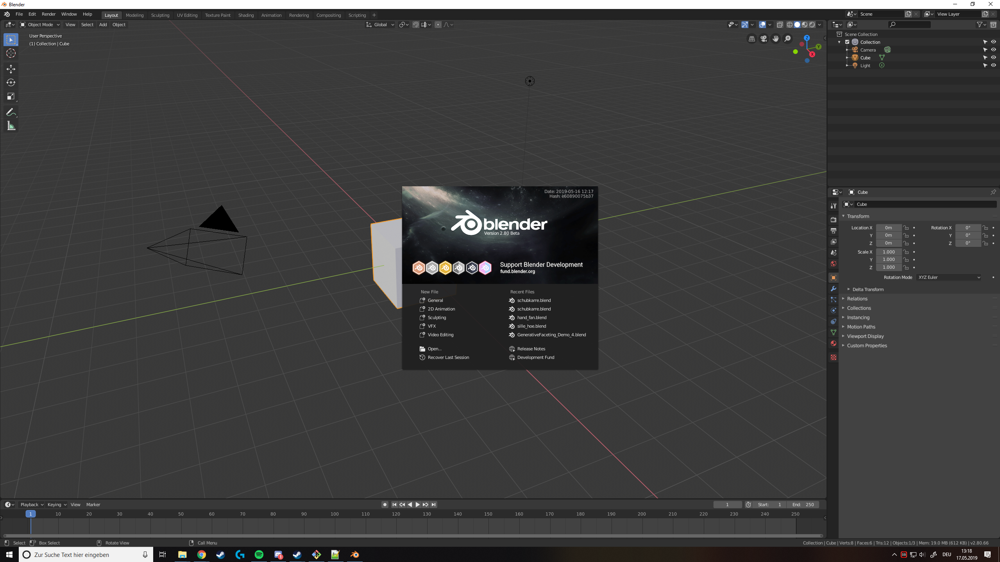

Dismiss the version information by pressing escape or clicking into the viewport

Now delete all the objects in the viewport by selecting them with **Left Click** and pressing **X** or **DEL** (ENTF)

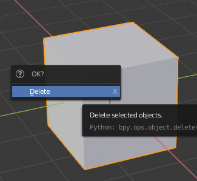

# 2. Camera Movement
To **zoom** the viewport, simply **scroll** the **Mouse Wheel** up or down while the cursor is over the viewport. Alternatively, you could hold down Ctrl + Mouse Wheel Button while moving your cursor up or down on the screen.

To **orbit** the viewport, hold down the **Middle Mouse Button** while moving your cursor around the viewport. Be sure to start holding down the middle mouse button while your cursor is inside the viewport.

To pan, hold down **Shift + Middle Mouse Button** while moving your mouse across the viewport. Just like orbiting, panning requires that your cursor be inside the viewport before you hold down the keys.

# 3. Starting Our Project
First of all, let's switch to the correct **Workspace** by clicking on **Modeling** in the **Top Left Corner**

Now, while having your cursor inside the viewport press **Shift + A** to open the "add" menu.

Select **Mesh** and then **Plane**

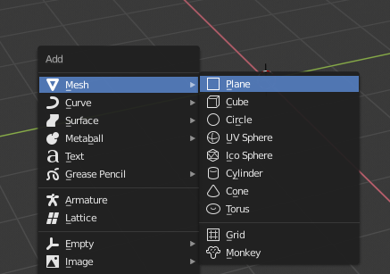

This should add a **Plane** to your project

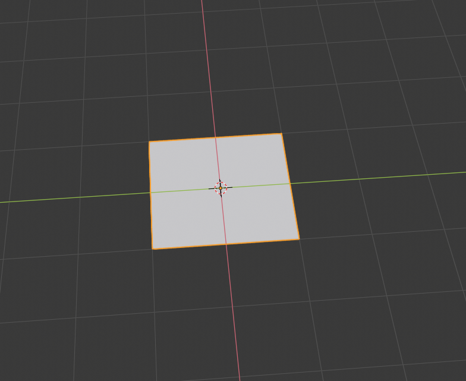

# 4. Creating Our Toast Model

## I like to move it move it
Let's start by **moving** our **Plane** to a better position.

If the Plane is **not highlighted** (orange border) **Left Click** on it

Then press **Tab** to switch **from Object Mode to Edit Mode*

**IMPORTANT: if you happen to click somewhere in the viewport and your model becomes unselected, press A to select it again**

And finally click on the **Move Tool** on the left **Toolbar**

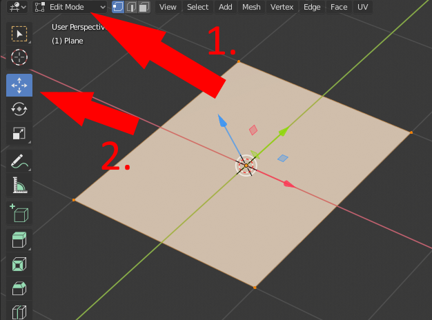

Now we are ready to actually **move the Plane**

Click on the little **blue Square** to move the Plane around on the **X and Y coordinates**

Then **Hold CTRL** and move the Plane **one step towards the X and Y direction**

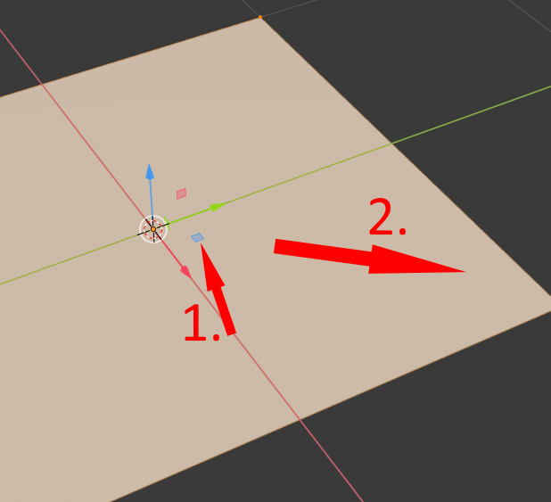

Your plane then should have **one corner** in the **origin** of the viewport

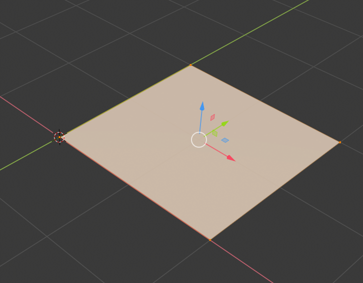

## Mirror it
Once verified, find the **Modifiers Tab** on the **right side** of your viewport

Then click on **Add Modifier** and select **Mirror**

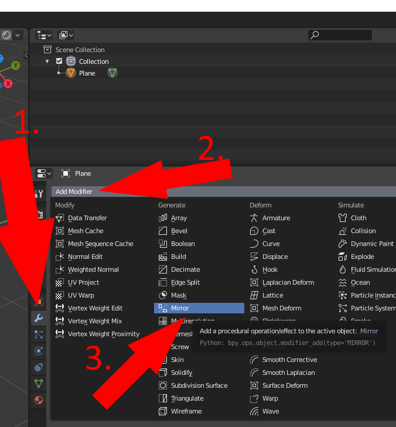

If done correctly, your toast should look like this:

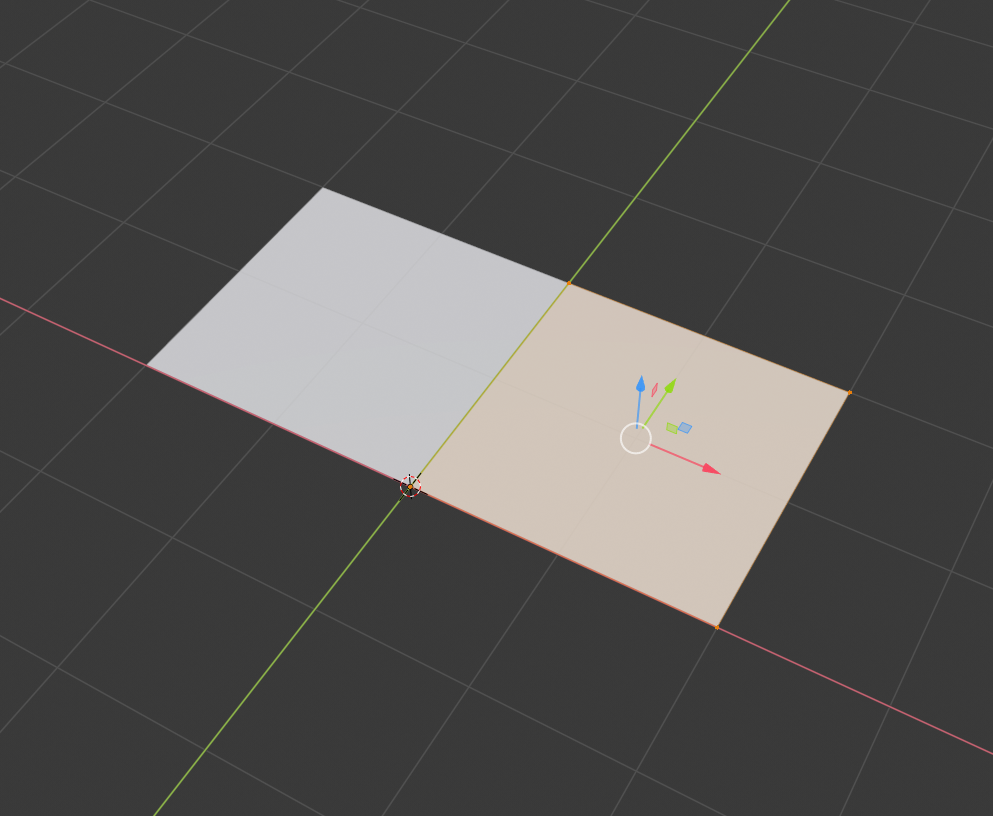

## Make it look like Toast

Start by selecting the **vertex** (little black dot) furthest from the center and **delete** it

Like last time, press **X** and then select **Vertecies**

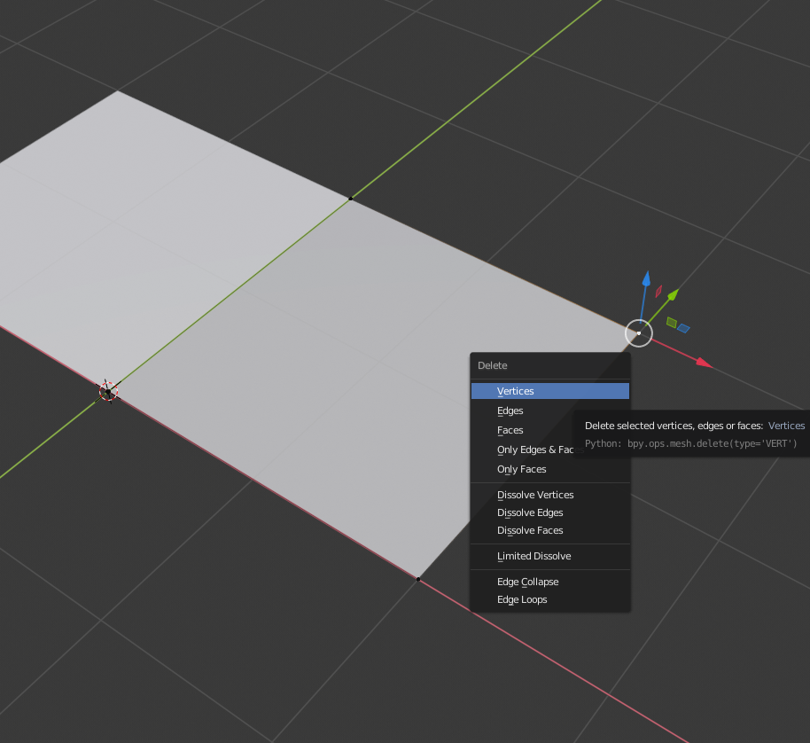

It now should look like the model is gone, but if you press **A** there should still be 3 **highlighted Vertecies**

now to edit your toast first press **NUMPAD 7**, or if you don't have a numpad press **The Z Axis** in the top left corner of your viewport

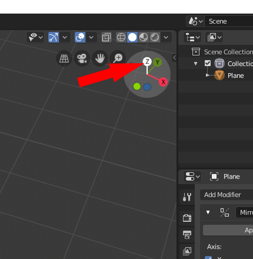

**If you accidentally rotate your Camera (Middle Mouse Button) simply repeat the last step**

Now it's time to make some toast!

Select the vertecies and move them with the arrows or the blue square
To make a **new** vertex that is connected to another one, press **E**. The new vertex is now snapped to your cursor so you can move it to the desired position and apply it with **Left Click**

**IMPORTANT:**
- You're modeling only the right half of the toast (remember that mirror modifier)
- If you want to delete a vertex, use **X** like before
- **WHEN YOU'RE DONE, SELECT THE LAST 2 VERTECIES OF THE LOOP AND PRESS F**
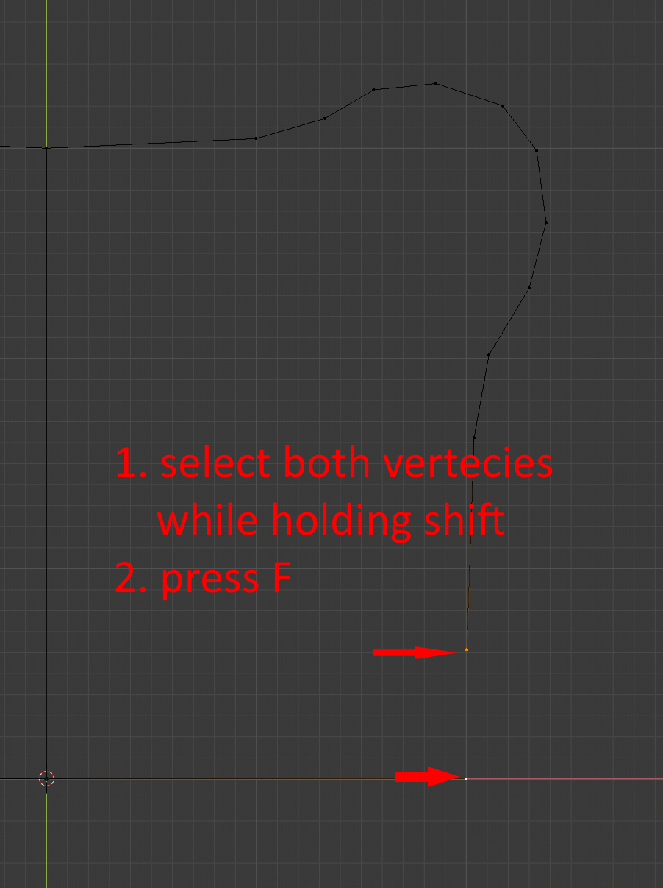

Now that our outline is done, let's put a pace into it, so we can see it again.

For that press **A** to select all vertecies

Then press **ALT + F**

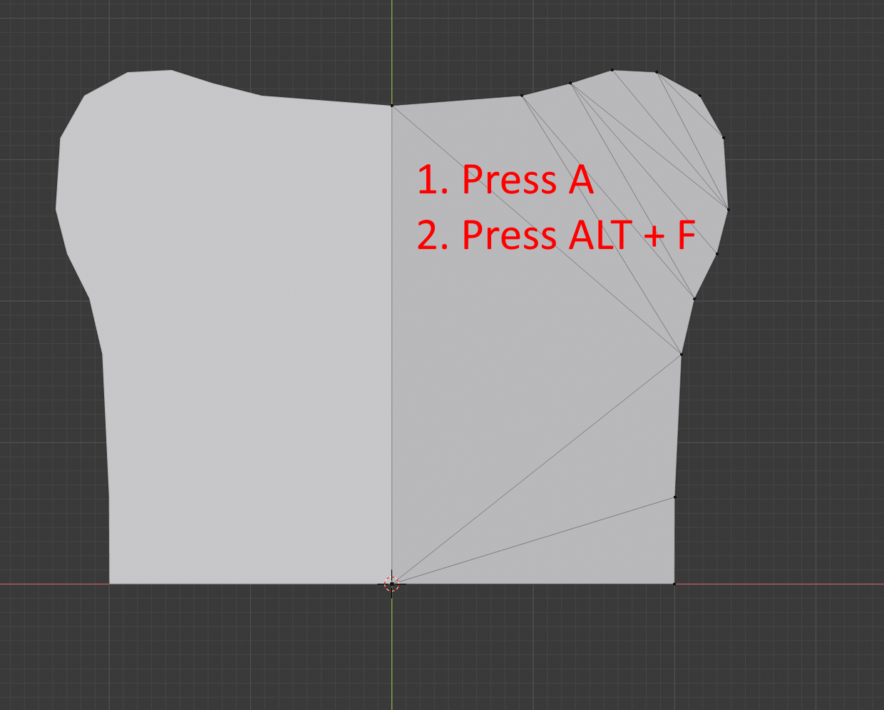

We can now **apply** that **Mirror Modifier**

Press **tab** in the viewport to get back to **object mode** and then click **Apply** in the **Modifier Tab**

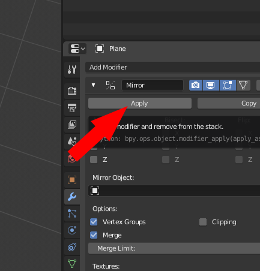

You can now **tab** back to **Edit Mode** to thicken that thin slice of toast.

To do that make sure all vertecies are selected by pressing **A** and then Press **E** and move your **Mouse down** and accept with **Left Click** on your desired thickness of toast

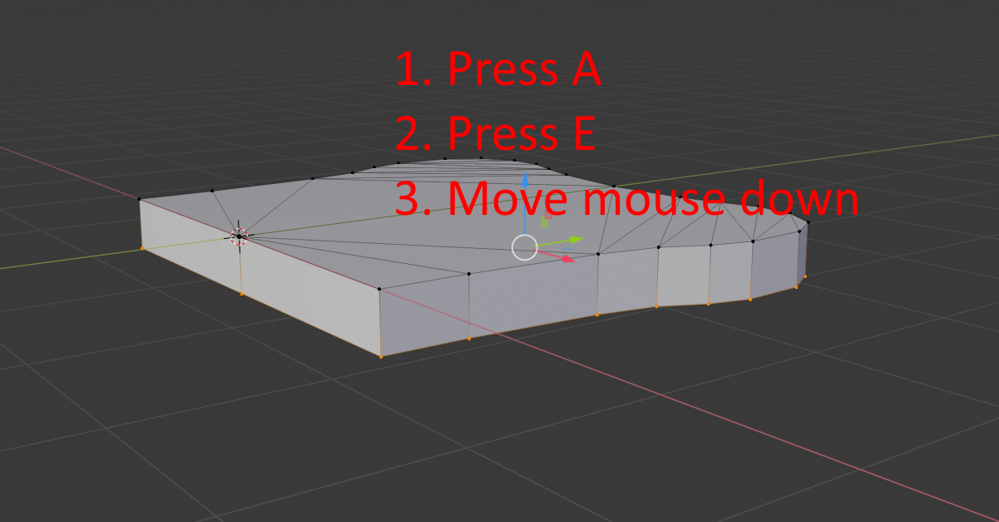

# 5. UV-Wrapping Our Toast

To begin **UV-Wrapping** switch to the **UV Editing Workspace**

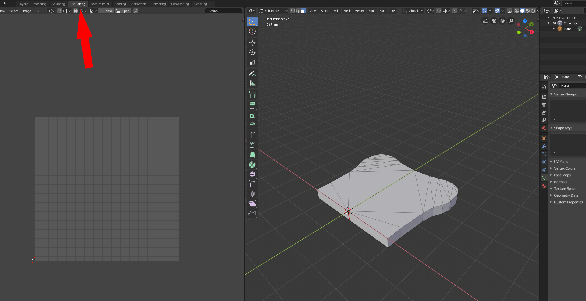

Then, in the left window, find the **Open Button** and select the **toast_texture.png** from the repository

Next, we have to give the uv unwrapper a hint where he should cut the texture of our toast

Press **2** (not numpad) to switch to **Edge Select** mode. Now select the edge in the center of your toasts bottom,
press **U** and select **Mark Seam**.

This edge should now have a red highlight.

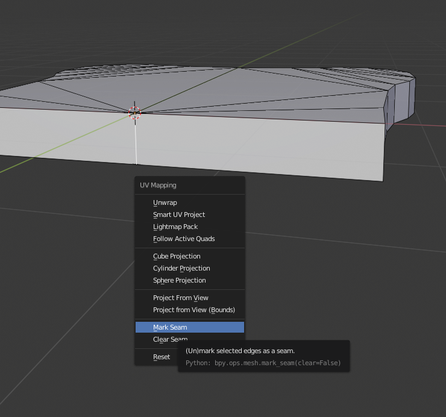

Now press **3** (not numpad) to switch to **Face Select** mode.

Hold the **ALT** key for **Loop Select** and click on your **Seam**

This should select the outer ring of your toast.

Then press **U** and select **Unwrap**.

To move the faces to the correct spot, press **A** to select all and then use the uv editors tools to move it.

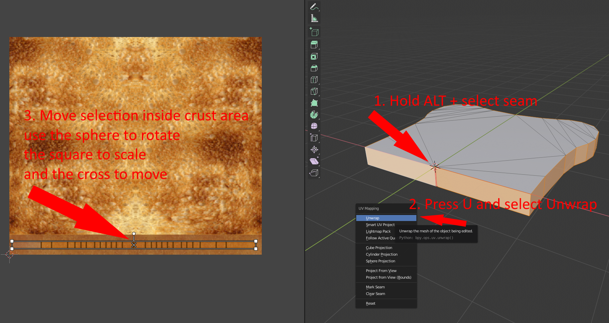

Without removing your selection, press **CTRL + I** in your viewport to **Invert** your selection,
and once again, press **U** and select **Unwrap** and move the selection to the correct spot on the left window.

To actually see your work, select **Display in LookDev Mode** in the top right of your viewport

Now click on **Material** in the right toolbar, add a **New** material, click the little circle next to **Base Color**
and select **Image Texture**.

Below the base color your can now **open** an image file, which will be the **toast_texture**.

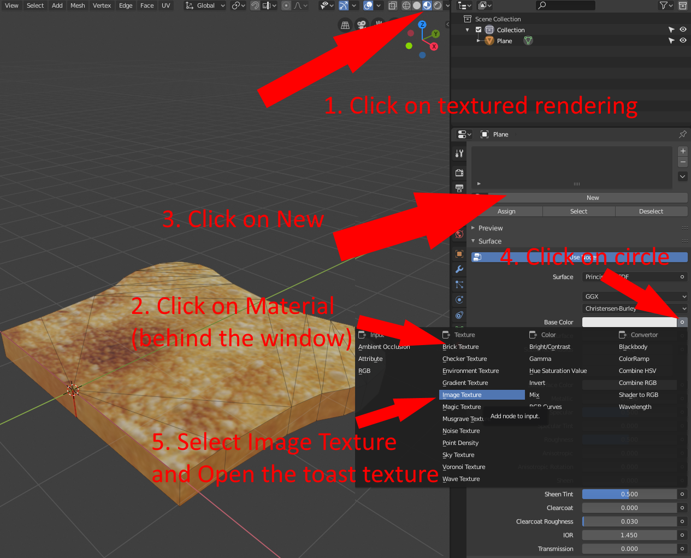

# 6. Animating Our Toast

We can now **TAB** back to **Object Mode** and proceed to the **Animation Workspace**

If your toast is white again, , select **Display in LookDev Mode** in the top right of your viewport.

From there, select the **Rotate Tool** and make your Toast stand upright

Finally press **I** and click on **Rotation**

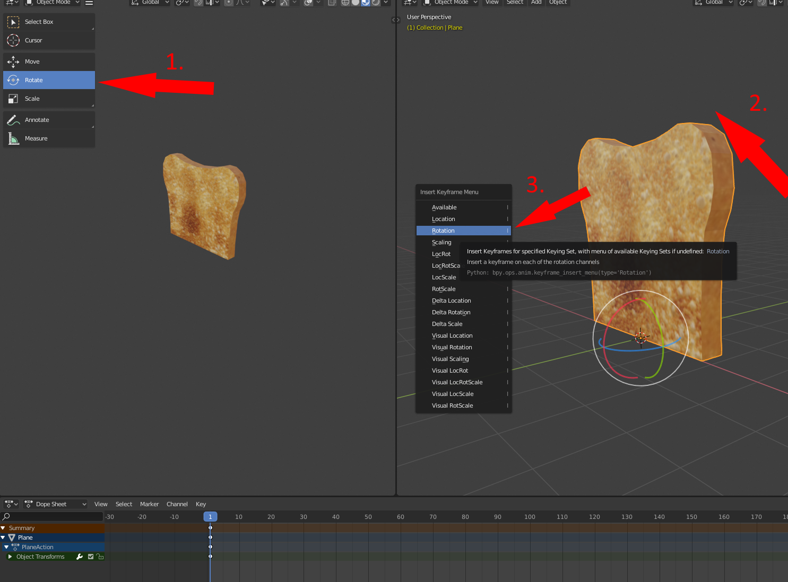

To make our toast fall over, move the **cursor** of the **timeline** to **20 frames**,

**Rotate** your toast to lay flat on the floor and then again press **I** and click on **Rotation**

Finally set the **End** of the animation to **30 frames** in the **bottom right** and press **Spacebar** to run the animation.

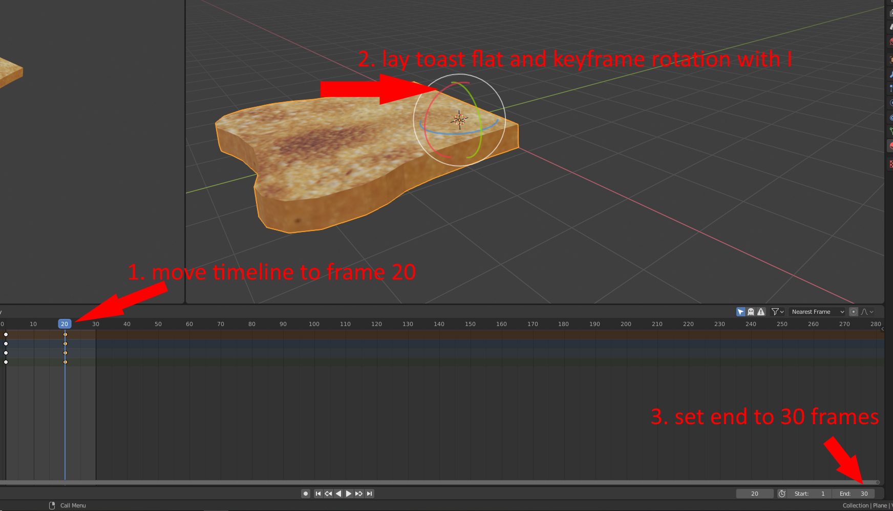

To make the flop look more physically accurate than linear movement, select **both keyframes** with **SHIFT** pressed,

**Right Click** on the **Timeline**, go to **Interpolation Mode** and select **Quartic** (^4)

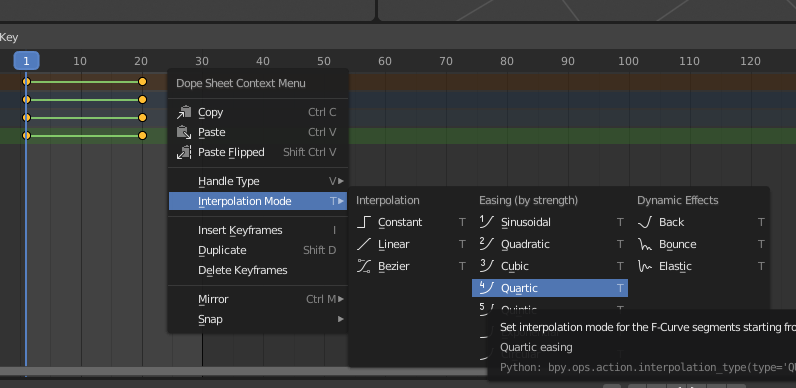
