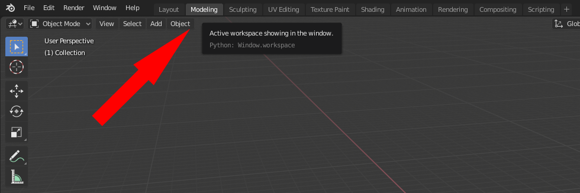

# Blender Hands On:

## Content:
- [1. Setting Blender Up](#1-setting-blender-up)
- [2. Camera Movement](#2-camera-movement)
- [3. Starting Our Project](#3-starting-our-project)
- [4. Creating Our Toast Model](#4-creating-our-toast-model)

# 1. Setting Blender Up
Extract Blender from the zip file provided in this repository and run it.

You should be greeted by this screen:

Dismiss the version information by pressing escape or clicking into the viewport

Now delete all the objects in the viewport by selecting them with **leftclick** and pressing **X** or **DEL** (ENTF)

# 2. Camera Movement
To **zoom** the viewport, simply **scroll** the **Mouse Wheel** up or down while the cursor is over the viewport. Alternatively, you could hold down Ctrl + Mouse Wheel Button while moving your cursor up or down on the screen.

To **orbit** the viewport, hold down the **Middle Mouse Button** while moving your cursor around the viewport. Be sure to start holding down the middle mouse button while your cursor is inside the viewport.

To pan, hold down **Shift + Middle Mouse Button** while moving your mouse across the viewport. Just like orbiting, panning requires that your cursor be inside the viewport before you hold down the keys.

# 3. Starting Our Project
First of all, let's switch to the correct **Workspace** by clicking on **Modeling** in the **Top Left Corner**

Now, while having your cursor inside the viewport press **Shift + A** to open the "add" menu.

Select **Mesh** and then **Plane**

This should add a **Plane** to your project

# 4. Creating Our Toast Model

## I like to move it move it
Let's start by **moving** our **Plane** to a better position.

If the Plane is **not highlighted** (orange border) **Left Click** on it

Then press **Tab** to switch **from Object Mode to Edit Mode*

**IMPORTANT: if you happen to click somewhere in the viewport and your model becomes unselected, press A to select it again**

And finally click on the **Move Tool** on the left **Toolbar**

Now we are ready to actually **move the Plane**

Click on the little **blue Square** to move the Plane around on the **X and Y coordinates**

Then **Hold CTRL** and move the Plane **one step towards the X and Y direction**

Your plane then should have **one corner** in the **origin** of the viewport

## Mirror it
Once verified, find the **Modifiers Tab** on the **right side** of your viewport

Then click on **Add Modifier** and select **Mirror**

If done correctly, your toast should look like this:

## Make it look like Toast
